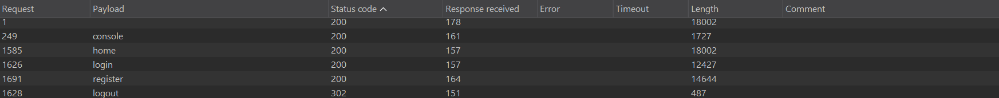
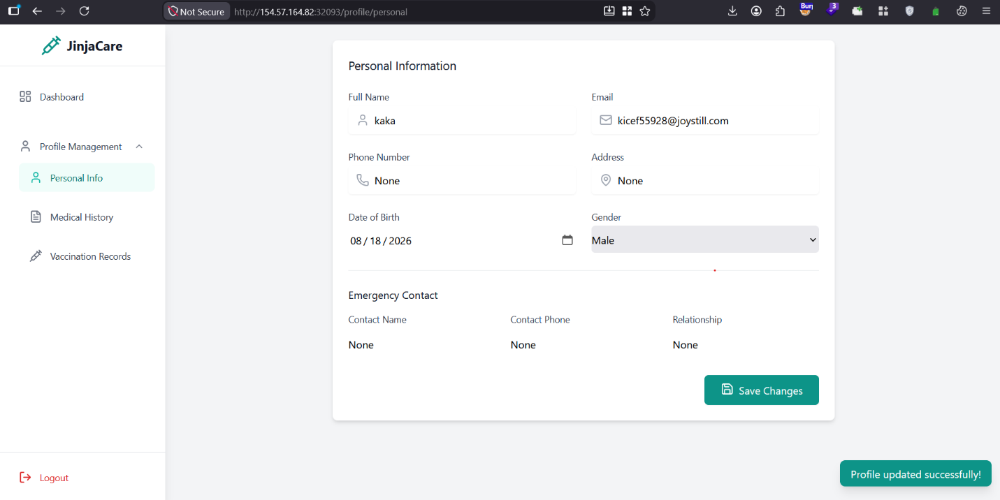
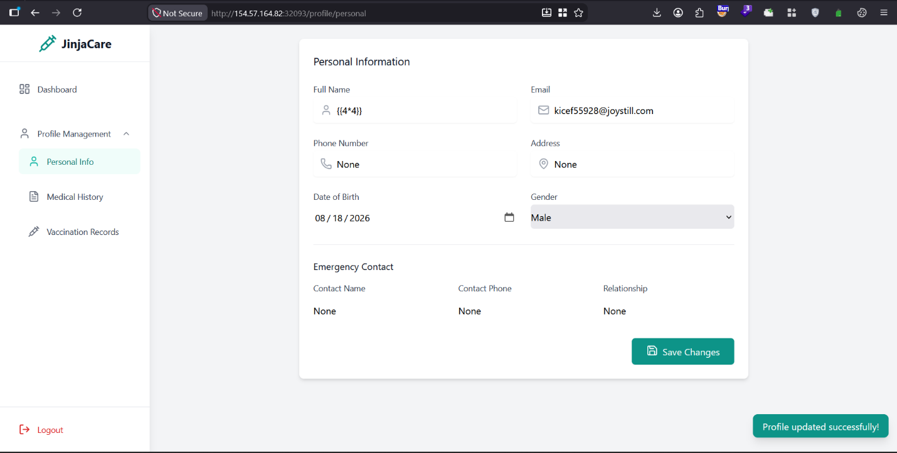
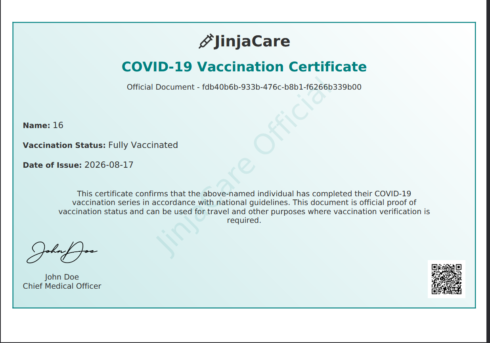
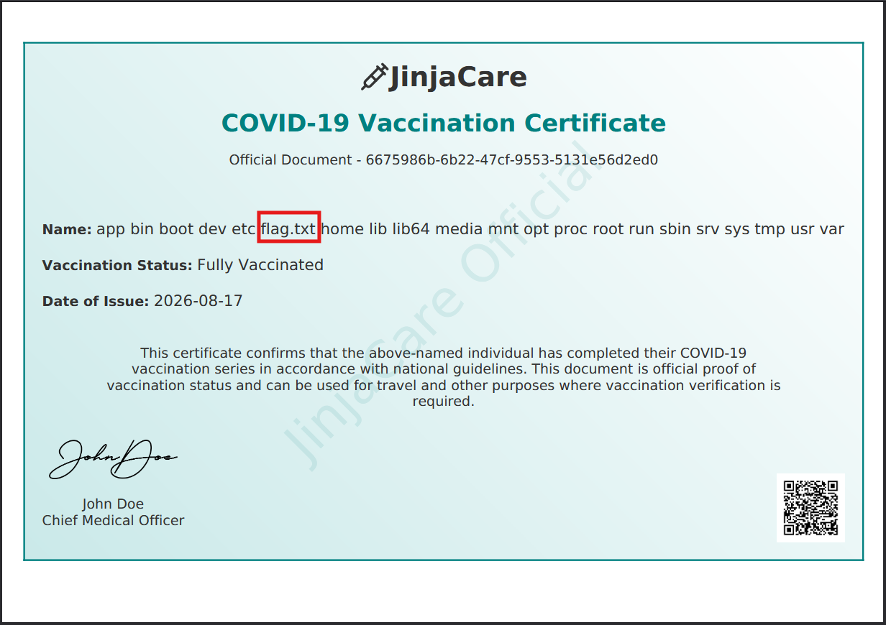

# JinjaCare — Hack The Box Web Challenge Walkthrough

**Category:** Web | **Vulnerability:** Server-Side Template Injection (SSTI) → RCE
**Tools used:** Burp Suite (Proxy, Intruder)

---

## Introduction

JinjaCare is a web-based Hack The Box challenge that focuses mainly on web application enumeration and exploitation.

In this write-up, I'll walk through my approach from the initial enumeration to identifying the vulnerable functionality and eventually turning the SSTI vulnerability into command execution.

---

## Initial Enumeration

I started by interacting with the application and intercepting the requests through Burp Suite. I used Burp Suite Intruder to fuzz for accessible endpoints and see if there were any interesting pages that were not linked from the main application.

The fuzzing did not reveal anything particularly interesting, but I identified four endpoints:

- `/register`
- `/login`
- `/home`
- `/console`

The `/register` and `/login` endpoints were related to authentication, while `/home` appeared to be the main application page.

The endpoint that immediately caught my attention was `/console`, so I decided to investigate it further.



---

## Analyzing /console

When I accessed `/console`, I found that the application was exposing the Werkzeug Debugger Interactive Console.

The response contained:

```
Console // Werkzeug Debugger
Interactive Console
```

This was interesting because an exposed Werkzeug debugger can potentially lead to serious impact if the console can be accessed and Python code can be executed.

The debugger also exposed several internal variables:

```
CONSOLE_MODE = true
EVALEX = true
EVALEX_TRUSTED = false
SECRET = "<redacted — instance-specific>"
```

The `SECRET` value was interesting, but I could not immediately find a useful way to use it.

More importantly, the debugger was protected by a PIN:

```
Console Locked
The console is locked and needs to be unlocked by entering the PIN.
```

Since `EVALEX_TRUSTED` was set to `false`, I could not simply use the debugger to execute Python expressions.

At this point, I decided not to spend too much time on the debugger and moved on to examining the actual application functionality.

---

## Application Functionality

After accessing the application, I found several different features available to the user:

- **Dashboard** — allows users to download their COVID certificate.
- **Personal Info** — allows users to update their name, email, phone number, and address.
- **Medical History** — allows users to add medical history records.
- **Vaccination Records** — allows users to add vaccination records.

I started going through these features one by one and captured the corresponding HTTP requests in Burp Suite.

The **Personal Info** functionality looked particularly interesting because it allowed user-controlled information to be submitted to the server.

---

## CSRF Analysis

While testing the Personal Info functionality, I identified the following endpoint:

```
/profile/personal
```

The endpoint allowed me to update information such as my name, email address, phone number, and address.

I investigated the request for possible CSRF protection and identified a potential CSRF issue. However, exploiting it did not give me access to the flag or provide a useful path toward code execution.

Rather than spending more time on an attack that was not producing results, I continued testing how the application processed the submitted values.

---

## Server-Side Template Injection

While testing the `/profile/personal` endpoint, I noticed something interesting with the **Full Name** field.




Instead of entering normal text, I decided to test whether the application was evaluating template expressions.

I submitted:

```
{{4*4}}
```



After saving the changes, the application displayed:

```
16
```



This was a strong indication that the input was being processed as a server-side template rather than being treated as plain text.

The vulnerable parameter was:

```
name
```

The fact that `{{4*4}}` was evaluated and returned `16` confirmed that I had found Server-Side Template Injection (SSTI).

---

## Exploiting the SSTI

Once I confirmed the SSTI, the next step was to determine whether I could use the template context to access Python functionality.

I tested the following payload:

```jinja
{{ self.__init__.__globals__.__builtins__.__import__('os').popen('ls /').read() }}
```

The payload uses Python's built-in `__import__()` function to import the `os` module. I then used `os.popen()` to execute the `ls /` command and read its output.

The command output was returned by the application, confirming that the SSTI could be escalated to server-side command execution.



At this point, I had confirmed an SSTI-to-RCE attack path.

---

## Conclusion

JinjaCare was a good example of why thorough web application enumeration is important. I initially focused on the exposed Werkzeug debugger, but the console was protected by a PIN, so it did not provide a direct path forward.

After moving on to the application's normal functionality, I found the `/profile/personal` endpoint and began testing how user-controlled input was processed. This led to the discovery of Server-Side Template Injection in the `name` parameter.

The simple `{{4*4}}` test confirmed that the server was evaluating Jinja expressions. From there, I was able to access Python functionality and execute an `ls /` command through the template, confirming an SSTI-to-RCE attack path.

The main takeaway from this challenge was to keep testing different parts of the application instead of becoming fixated on the first interesting endpoint. Careful input testing and understanding how server-side data is processed can reveal vulnerabilities that are not immediately obvious during initial enumeration.
